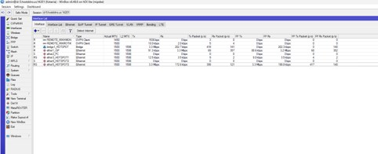
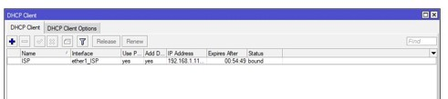
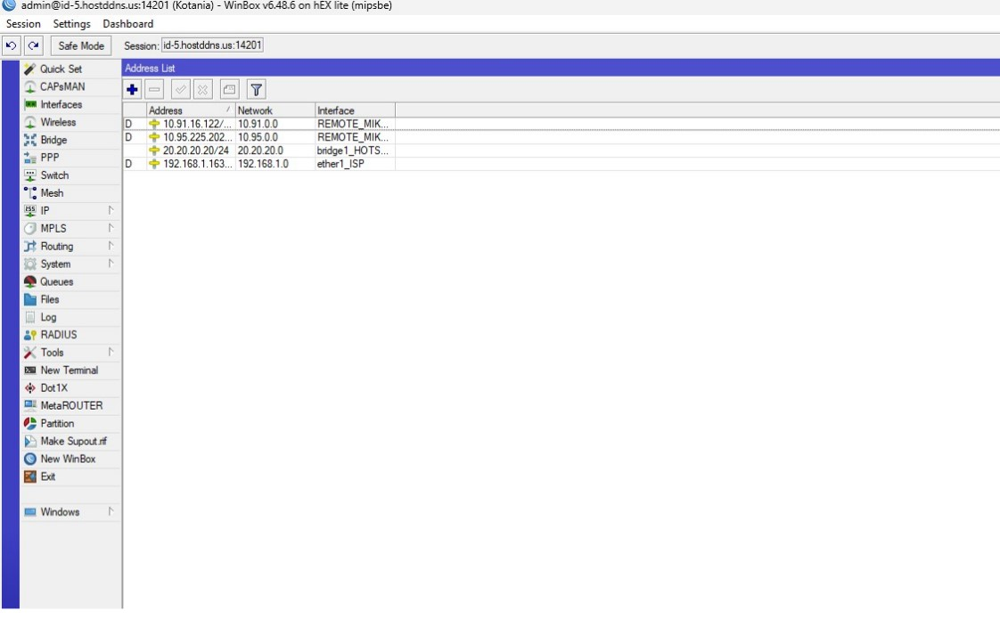
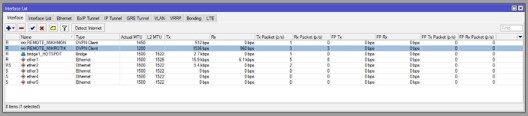
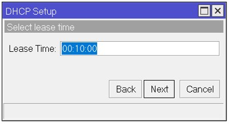

# Langkah Konfigurasi MikroTik dan Starlink

## Deskripsi

Dokumentasi ini berisi langkah-langkah konfigurasi MikroTik pada implementasi jaringan internet berbasis Starlink. Konfigurasi dilakukan untuk mengatur distribusi koneksi internet dari Starlink menuju pengguna melalui perangkat MikroTik dan Access Point.

## 1. Persiapan Perangkat

Perangkat yang digunakan dalam implementasi jaringan terdiri dari:

- Starlink sebagai sumber koneksi internet.
- Router MikroTik sebagai perangkat manajemen jaringan.
- Access Point sebagai perangkat distribusi jaringan kepada pengguna.
- Kabel LAN/Fiber Optic sebagai media transmisi jaringan.
- Laptop/PC untuk melakukan konfigurasi menggunakan aplikasi WinBox.

---

# 2. Topologi Jaringan

Implementasi jaringan menggunakan Starlink sebagai sumber koneksi internet yang terhubung ke router MikroTik. MikroTik berfungsi sebagai perangkat pengelola jaringan yang melakukan konfigurasi alamat IP, distribusi koneksi internet, serta pengaturan layanan Hotspot kepada pengguna melalui Access Point.

---

# 3. Konfigurasi MikroTik

Tahapan konfigurasi MikroTik pada implementasi jaringan Starlink meliputi:

1. Konfigurasi Interface MikroTik
2. Konfigurasi Bridge Hotspot
3. Konfigurasi DHCP Client
4. Konfigurasi IP Address
5. Konfigurasi DHCP Server untuk Jaringan Hotspot
6. Konfigurasi Lease Time DHCP
7. Aktivasi DHCP Server pada Jaringan Hotspot
8. Konfigurasi NAT (Network Address Translation)
9. Konfigurasi Hotspot MikroTik
10. Konfigurasi User Profile dan User Hotspot
11. Pengujian Koneksi Jaringan

---

# 3.1 Konfigurasi Interface MikroTik

Konfigurasi interface dilakukan untuk menentukan fungsi setiap port pada MikroTik. Interface yang digunakan disesuaikan dengan kebutuhan jaringan, yaitu koneksi dari Starlink dan jaringan distribusi menuju pengguna.

---

# 3.2 Konfigurasi Bridge Hotspot

Bridge digunakan untuk menggabungkan beberapa interface jaringan Hotspot agar berada dalam satu segmen jaringan yang sama. Pada implementasi ini, beberapa interface Hotspot digabungkan ke dalam Bridge1-HOTSPOT.

---

# 3.3 Konfigurasi DHCP Client

DHCP Client digunakan agar MikroTik memperoleh alamat IP secara otomatis dari perangkat Starlink sebagai sumber koneksi internet.

Konfigurasi dilakukan melalui menu:

IP → DHCP Client

---

# 3.4 Konfigurasi IP Address

IP Address digunakan untuk memberikan alamat jaringan lokal pada interface Bridge1-HOTSPOT sebagai gateway bagi perangkat pengguna.

Konfigurasi dilakukan melalui menu:

IP → Addresses

---

# 3.5 Konfigurasi DHCP Server untuk Jaringan Hotspot

DHCP Server digunakan untuk memberikan alamat IP secara otomatis kepada perangkat pengguna yang terhubung melalui jaringan Hotspot.

Konfigurasi DHCP Server dilakukan pada interface Bridge1-HOTSPOT.

---

# 3.6 Pengaturan Lease Time DHCP

Lease Time digunakan untuk menentukan lama waktu penggunaan alamat IP yang diberikan kepada perangkat pengguna sebelum dilakukan pembaruan kembali.

---

# 3.7 Aktivasi DHCP Server untuk Jaringan Hotspot

Setelah seluruh parameter DHCP Server dikonfigurasi, layanan DHCP Server diaktifkan untuk jaringan Hotspot agar perangkat pengguna dapat memperoleh alamat IP secara otomatis.

---

# 3.8 Konfigurasi NAT (Network Address Translation)

NAT digunakan untuk menerjemahkan alamat IP jaringan lokal agar perangkat pengguna dapat mengakses internet melalui koneksi Starlink.

Konfigurasi dilakukan melalui menu:

IP → Firewall → NAT

---

# 3.9 Konfigurasi Hotspot MikroTik

Hotspot digunakan untuk mengatur mekanisme autentikasi pengguna sebelum mendapatkan akses internet. Sistem ini digunakan untuk mendukung layanan akses internet berbasis voucher.

---

# 3.10 Konfigurasi User Profile dan User Hotspot

User Profile digunakan untuk mengatur batas waktu dan hak akses pengguna, sedangkan User Hotspot digunakan untuk membuat akun pengguna yang dapat melakukan autentikasi pada jaringan.

---

# 4. Pengujian Jaringan

Pengujian dilakukan untuk mengetahui performa jaringan internet Starlink setelah dilakukan konfigurasi MikroTik.

Parameter pengujian meliputi:

- Delay
- Jitter
- Packet Loss
- Throughput

## 4.1 Pengujian Ping

Pengujian ping dilakukan menggunakan alamat DNS Cloudflare (1.1.1.1) dan Google DNS (8.8.8.8).

---

## 4.2 Pengujian Throughput

Pengujian throughput dilakukan menggunakan aplikasi Speedtest untuk mengetahui kemampuan bandwidth download dan upload dari layanan Starlink.

